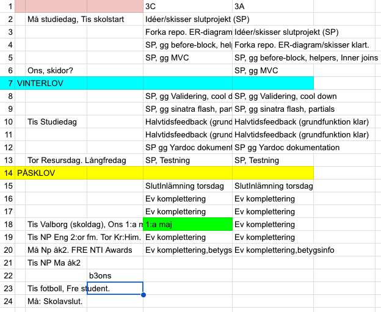

# slpws23
Slutprojekt 2024 Webbserverprogrammering.

##  Uppgiftsbeskrivning

Nu är det dags för att bygga en större applikation med hjälp av de tekniker vi har lärt oss i kursen Webbserverprogrammering. Syftet är att du ska lära dig att använda dina kunskaper för att bygga en webbapplikation med både front-end och back-end. Att ha kunskaper inom back-end-utveckling ger dig stora fördelar i livet om du tex ska bygga applikationer som sparar data och har användare med konton. Skulle du fortsätta med front-end (bara webbdesign) är det också väldigt meriterande att ha viss förståelse för vad som händer back-end. Både när du utvecklar själv men även när du kommunicerar med andra utvecklare.

Du kommer även under arbetets gång få miniföreläsningar om hur du kan göra utveckingen/koden snyggare, bättre och lättare att hantera. Tex att separera olika funktionalitet eller tips för att testa koden. 

##  Specifikation
- Valfri applikation, tex webbshop, forum, föreningssida med användare, företagssida med olika användare...
- Individuellt projekt
- Forka grundrepo: https://github.com/ntijoh/tf.git
- Utvecklingsdagbok i dokument på classroom
- CSS är inget krav men är uppmuntrat
- Halvtidsavstämning v.10 på lektion (feedback av lärare, ha kod redo att visa upp). 
- v.15 slutinlämning
- Vid slutinlämning: Lämna in en liten film på classroom som visar applikationen 

## Lektionsstruktur
- Standup meetings i början på varje lektion
- Commits under lektion och push i slutet av lektion
- Eleven uppdaterar utvecklingsdagboken (classroom) det sista som händer på lektionen
- Vissa lektioner kommer läraren ha en kort genomgång (gg) om lite mer avancerade saker (C/A-nivå) som man kan addera till sitt projekt.

## Lektionsplanering

